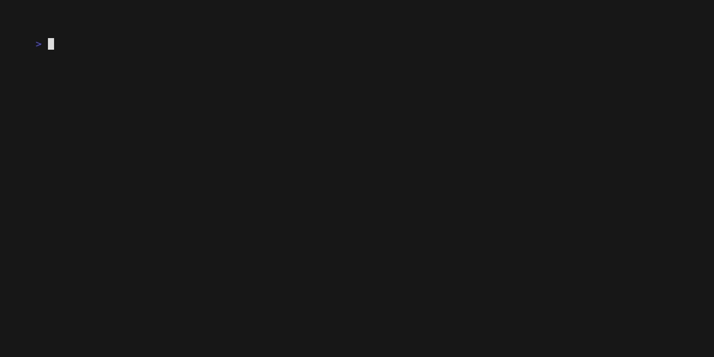

# CFDNS — Cloudflare Dynamic DNS Updater

CFDNS is a fast, reliable command-line Dynamic DNS updater for Cloudflare.
It discovers the best IPv4 and/or IPv6 addresses for each network interface, compares them to existing Cloudflare DNS records, and updates only when needed.



---

## Features
* Quick setup with `cfdns setup`
* Optional systemd-based scheduled updates via `cfdns schedule`
* IPv4 and IPv6 support
* Netlink-based IP detection for specific interfaces
* Optional public-IP lookup for NAT/WAN interfaces
* Dry-run mode

---

## Installation

### Install via Cargo

```sh
cargo install cfdns
```

### Build from source

```sh
git clone https://github.com/MatthewIsHere/cfdns
cd cfdns
cargo build --release
```

---

## Quick Start

### 1. Create a configuration file

```sh
cfdns setup
```

This creates:

```
~/.config/cfdns/config.yml
```

Example:

```yaml
cloudflare:
  token: YOUR_API_TOKEN

interfaces:
  eth0:
    records:
      - domain: zeus.example.com
        zone: example.com
        type: A
        web_lookup: true

  wg0:
    records:
      - domain: hera.example.com
        zone: example.com
        type: BOTH
```

### 2. Run an update

```sh
cfdns update
```

### 3. Schedule automatic updates

```sh
cfdns schedule
```
This installs a systemd --user timer that runs `cfdns update` every 5 minutes.  
Use `cfdns schedule --off` to remove it, or manually delete the unit files in `~/.config/systemd/user`.


---

## How It Works

1. Local IPs are discovered per interface using `rtnetlink`.
2. If `web_lookup` is enabled, public IPs are fetched from an external service.
3. Existing DNS records are retrieved from Cloudflare.
4. Updates are performed only if the IP address differs.
5. If a record does not exist, it is created using Cloudflare defaults.
6. TTL and proxy settings are preserved; CFDNS only updates IP addresses.

---

## Configuration Details

### Record Types

| Type   | Meaning                |
| ------ | ---------------------- |
| `A`    | Update IPv4 only       |
| `AAAA` | Update IPv6 only       |
| `BOTH` | Update both A and AAAA |

### `web_lookup`

If `true`, public IPv4/IPv6 is determined using the [Cloudflare trace service](https://cloudflare.com/cdn-cgi/trace).
Useful when the interface has a private or non-routable address.

---

## License

CFDNS is licensed under the **Apache License 2.0**.
See the [LICENSE](LICENSE) file for details.

---

## Contributing

Pull requests and issue reports are welcome.

This project is actively maintained, and new features will continue to be added over time. If you find any issues with the program, have new ideas, or formatting suggestions, please let me know!
